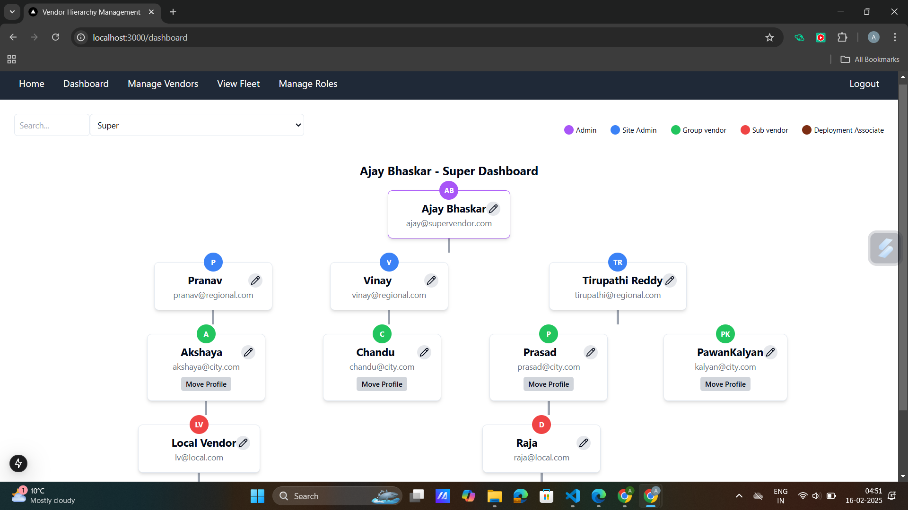

# Vendor Management System

## Overview
A role-based vendor management system built using **Next.js** and **Redux** (UI only). This system manages fleets, vendors, and driver assignments.

## Features
- **Super Vendor**: Manages all vendors, roles, and fleet assignments.
- **Regional Vendor**: Assigns vehicles to City Vendors.
- **City Vendor**: Onboards and assigns drivers to vehicles.
- **Local Vendor**: Manages deployed drivers and vehicles.
- **Deployment Associate**: Views assigned tasks.

## Installation
```sh
npm install
npm run dev
```

## Screenshots

### **Login & Home Page**
These are the entry points to the system where users authenticate and access their dashboards.
- **Login Page**: 
- **Home Page**: 
- **Edit Operation**: 
- **move Operation**: 


### **Super Vendor**
The Super Vendor has the highest level of control over all operations, including managing vendors, assigning fleets, and defining roles.
- **Dashboard**: The central control panel for Super Vendors.
  
- **Manage Vendors**: View, add, edit, and delete vendor nodes in a structured table.
  
- **View Fleet**: Displays available cars and their details. Cars are assigned to Regional Vendors here.
  
  

- **Manage Roles**: Controls navigation permissions for each role.
  
  


### **Regional Vendor**
The Regional Vendor manages fleets and city vendors but cannot modify higher-level entities.
- **Dashboard**: Limited dashboard view with control over assigned fleets. Here you are not allowed to edit Super vendors
  
- **Regional Fleet Management**: Assigns vehicles to City Vendors that are children's of current Regional vendor.
  
- **Manage City Vendors**: Allows adding, editing, and removing City Vendors.
  

### **City Vendor**
City Vendors focus on driver onboarding and vehicle assignments.
- **Dashboard**: Similar to the regional dashboard but limited to City Vendor controls.
  
- **Onboard Drivers**: Facilitates driver onboarding, document collection, and vehicle assignments.
  

### **Local Vendor**
Local Vendors manage vehicle deployment and driver allocations.
- **Dashboard**: Displays assigned vehicles and deployment options.
  
- **Deployed Tasks**: Lists drivers and their assigned vehicles.

### **Deployment Associate**
Deployment Associates can only view their assigned tasks.
- **Dashboard**: Displays their personal task assignments.
  
- **View Tasks**: Shows the tasks assigned to the associate.
  

## Note
- The system dynamically fetches assigned vehicles based on roles.
- Role-based permissions control which actions and data each user can access.


## Demo Video:
[Watch the Demo Video](https://drive.google.com/file/d/1mdS9Lz-Lx5oR9z7jyDibysmFm_IYbW9f/view?usp=drive_link)
